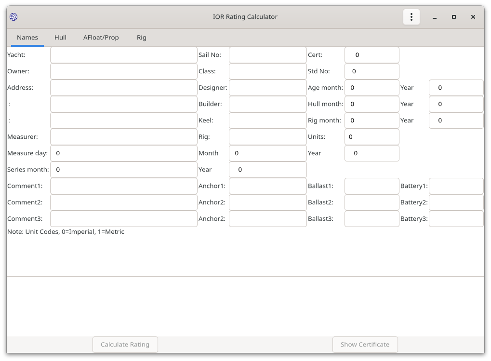
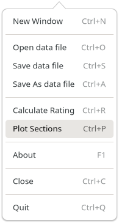
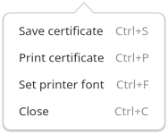
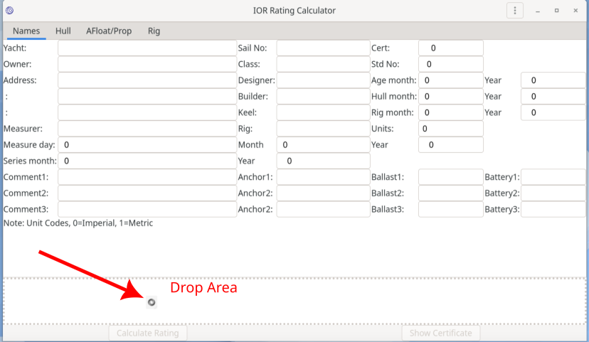

# IORCalc

Calculate IOR ratings like it's 1988 again.

## Introduction

`iorcalc` is an application to input / edit IOR measurement data and generate IOR rating certificates. The application includes all rule amendments to January 1988; after which the author started sailing on non-IOR (CHS) yachts.

`iorcalc` was last validated against official (RORC Rating Office) certificates in 1986; any 1987-198 rule changes are not validated.

`iorcalc` is a fairly complete coverage of the IOR rule; there are some esoteric rigs that are not covered (gaff, schooners probably). However there is some commented out BASIC code in `calc_rig.c` that should cover the omitted cases if required.

`iorcalc` was written in 1984/5 to run on a Sinclair QL (QDOS OS). It was largely forgotten until the author stumbled upon an old floppy disk, after which is was updated and a modern UI added.

## Usage

### Sample Data

Two sample data files are in the repositry `samples` directory. These are also provided in the binary packages, in `$INSTALLTION_ROOT/share/doc/iorcalc/` (where `$INSTALLTION_ROOT` is the base of the installed package). Using the provided binary packages, `/usr` on Linux and `Program Files\iorcalc` on Windows.

### Data Entry

Launch from a desktop icon or from the command line. If invoked from the command line, a data file may be given; this probably means drag and drop will work in Windows.

Drag and drop onto the [lower status area](#drag_and_drop) is available on FreeBSD, Linux, MacOS; due to a bug in the Windows GTK library it is not *yet* available on Windows.

```
$ iorcalc samples/manitou4.json
```

The main window will be displayed (empty without an input file):



The menu (load files etc.) is invoked from the highlighted "hamburger" icon

11

It is possible to open multiple windows (**New Window**) with independant data and certificate views."Close" closes the window (and quits if it was the only window), "Quit" exits the application.

The **Calculate Rating** option is only enabled when a representative set of data has been input or loaded.

Data may be saved **Save data file**, **Save As data file** at any time.

The **Open data file** option presents a file chooser to allow the selection of previously saved data file (JSON format). This will populate the data tabs `Names`, `Hull`, `Afloat/Prop` and `Rig`, for example:

Manual data entry requires that each of the tabs be populated. In particular, the **Calculate Raing** option will not be enabled until the following items are populated:

* Yacht (name)
* Sail number
* Age data
* Hull data: LOA,  FGO, AGO,  FD, CMD, MD, OMD, BMAX, B, BF, BFI, BAI, BA, GD, Y, VHAI, VHA, SBMAX, SDM, FSS, FFS, FFIS, FFDS, FBIS, FMDS, FAIS, FAS, DMS
* Afloat data: FF, FA, BWL
* Rig data: P, E, BAS (so cat rigs are OK).

This is just a representative sanity sample.


### Calculate Rating

Once sufficient data is entered to calculate the rating, this may be invoked from the main menu.

After the calculation is completed:

* A summary is presented below the input form
* The **Show Certificate** button is enabled.

It is possible that the data sanity checks are insufficient, and invalid or missing user entered data could cause the application to crash. In this case, your data will be saved as `$TMP/.iorcalc-save.json` (`$TMP` represents the operating system's temporary directory, typically `/tmp` on Linux / FreeBSB).

### Viewing the Certificate

When the **Show Certificate** is invoked, the certificate will be displayed in a separate scrollable  window.


This also has a menu:



There are three options:

* **Save certificate** : Saves the certificate as a text document (two separate pages, separated by `FORMFEED` (`Ctrl-L`).
* **Print** : Prints the certificate, using the operating system Print Dialog. If `portrait` is selected, the certificate is printed on two sheets, if `landscape`, the certificate is printed on a single sheet. Print to file (PDF, PS, SVG, XPS) as available in the native dialogue. The choices (PDF / Printer, Portrait / Landscape, PDF file name) are cached for future use.

     

* **Set printer font**. By default, the system default `Monospace` font is used. This optiom presents a Font Button allowing an alternate font to be used. This is also cached for future use
     

    Clicking on the Font Button opens a larger dialog allowing selection of a different font.
     

* **Close** : Closes the certificate window.

#### Printing details

* If `portrait` is selected, the selected font and size are used without further analysis. A 10 point font should fit on an A4 / US Letter page. Most operating systems have a `Preview` option to verify that the font will allow output page coverage.
* If `landscape` is selected, the font is scaled to fit the two pages of the certificate  on the printer page. On A4, this results in a readable c. 7pt font. The font will not be scaled above the user specified size.
* On MacOS, it appears necessary to build against GTK4 to get working printing.


### Drag and Drop

On FreeBSD, Linux and MacOS, it is possible to drag and drop data files onto the lower status area.



The drop area is shown with a "dotted" border when drag and drop is being used, once the drop data is over that area.

A new window will open showing the dropped data (if valid).

## Bug Reports

If `iorcalc` fails to calculate a rating, or calculates an incorrect rating, please raise an issue on the Github issue tracker. If you have an original IOR certificate for the yacht, a scan of that would help resolve any issues. Please also supply the `iorcalc` JSON data file.

## Author, Licence

(c) Jonathan Hudson 1984-2022.

GPL3 or later.
