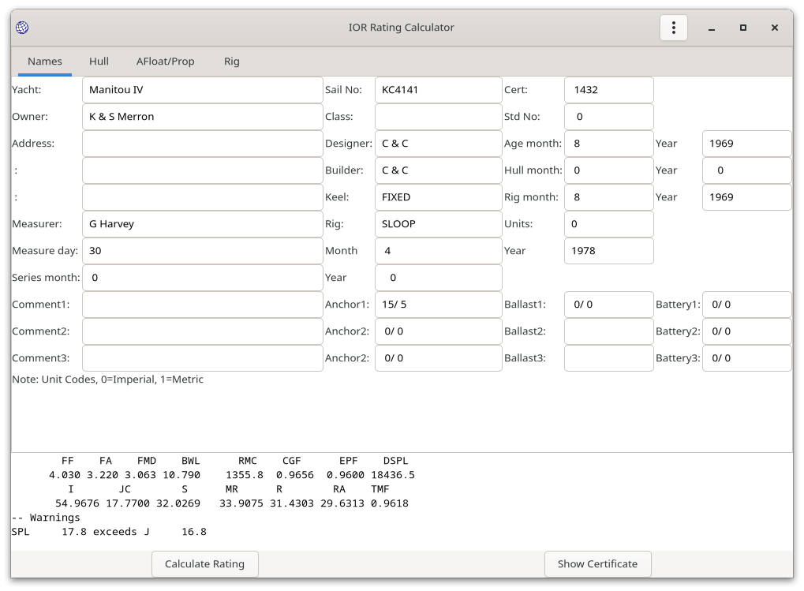

# IORCalc

Calculate IOR ratings like it's 1988 again.

## Introduction

`iorcalc` is an application to input / edit IOR measurement data and generate IOR rating certificates. The application includes all rule amendments to January 1988; after which the author started sailing on non-IOR (CHS) yachts, which was much more fun.

`iorcalc` was last validated against official (RORC Rating Office) certificates in 1986; any 1987-198 rule changes are not validated.

`iorcalc` is a fairly complete coverage of the IOR rule; there are some esoteric rigs that are not covered (schooners probably). However there is some commented out BASIC code in `calc_rig.c` that should cover the omitted cases if required.

`iorcalc` was written in 1984 to run on a Sinclair QL (QDOS OS). It was largely forgotten until the author stumbled upon an old floppy disk, after which is was updated and a modern UI added.

## Usage

### Data Entry

Launch from a desktop icon or from the command line. If invoked from the command line, a data file may be given; this probably means drag and drop will work in Windows.

```
$ iorcalc samples/summerwine.json
```

The main window will be displayed (empty without an input file):


The menu (load files etc.) is invoked from the highlighted "hamburger" icon


The **Calculate Rating** option is only enabled when a representative set of data has been input or loaded.

Data may be saved **Save data file**, **Save As data file** at any time.

The **Open data file** option presents a file chooser to allow the selection of previously saved data file (JSON format). This will populate the data tabs `Names`, `Hull`, `Afloat/Prop` and `Rig`, for example:



Manual data entry requires that each of the tabs be populated. In particular, the **Calculate Raing** option will not be enabled until the following items are populated:

* Yacht (name)
* Sail number
* Age data
* Hull data: LOA,  FGO, AGO,  FD, CMD, MD, OMD, BMAX, B, BF, BFI, BAI, BA, GD, Y, VHAI, VHA, SBMAX, SDM, FSS, FFS, FFIS, FFDS, FBIS, FMDS, FAIS, FAS, DMS
* Afloat data: FF, FA, BWL
* Rig data: P, E, BAS (so cat rigs are OK).

This is just a representative sanity sample.

### Calculate Rating

Once sufficient data is entered to calculate the rating, this may be invoked from the main menu.

After the calculation is completed:

* A summary is presented below the input form
* The **Show Certificate** button is enabled.


It is possible that the data sanity checks are insufficient, and invalid or missing user entered data could cause the application to crash. In this case, your data will be saved as `$TMP/.iorcalc-save.json` (`$TMP` represents the operating system's temporary directory, typically `/tmp` on Linux / FreeBSB).

### View Certificate

When the **Show Certificate** is invoked, the certificate will be displayed in a separate scrollable  window.


There are three options:

* **Save to file** : Saves the certificate as a text document (two separate pages).
* **Print** : Prints the certificate as separate (two) pages. This is only available on POSIX (Linux, *BSD, MacOS) platforms that have a `lp` command.
* **Close** : Closes the certificate window.

## Bug Reports

If `iorcalc` fails to calculate a rating, or calculates an incorrect rating, please raise an issue on the Github issue tracker. If you have an original IOR certificate for the yacht, a scan of that would help resolve any issues. Please also supply the `iorcalc` JSON data file.

## Author, Licence

(c) Jonathan Hudson 1984-2022. 

GPL3 or later.
